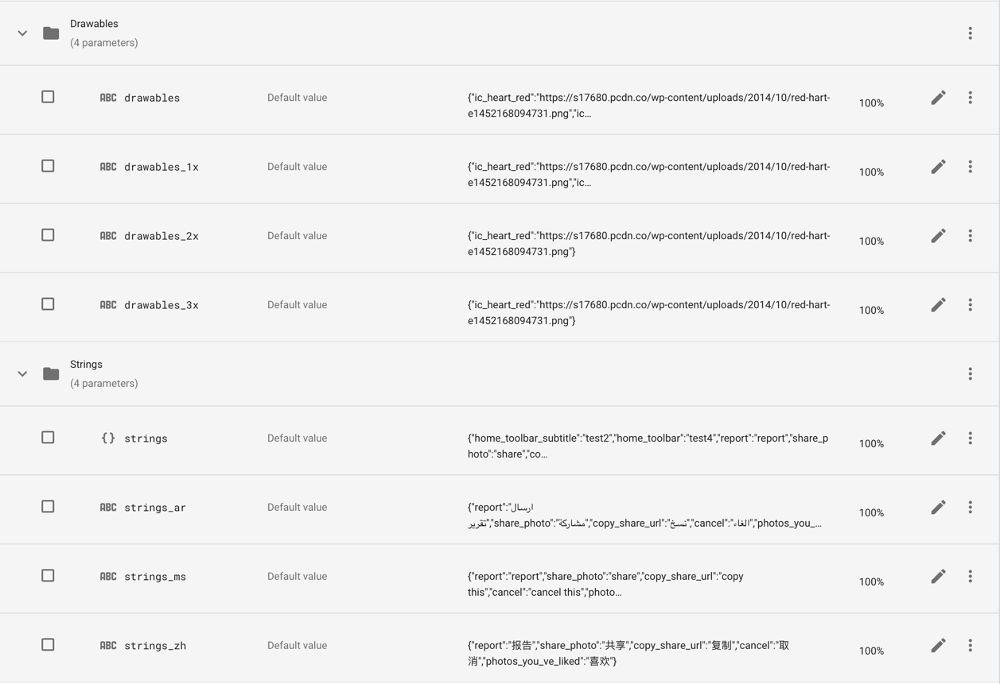

[](https://jitpack.io/#telereso/telereso)
[](https://pub.dartlang.org/packages/telereso)
[](https://www.npmjs.com/package/telereso)
[](https://www.npmjs.com/package/telereso-web)

Table of contents:

* auto-gen TOC:
{:toc}

## Installation

[Telereso](https://telereso.io?utm_source=github&utm_medium=readme&utm_campaign=normal) depends on Firebase to
use [Remote Config](https://firebase.google.com/docs/remote-config/) for resource management<br>
And [Cloud Messaging](https://firebase.google.com/docs/cloud-messaging) for realtime changes (_optional_)

All you need to get started is make sure your project has setup
firebase ([check docs](https://firebase.google.com/docs/guides)) <br>
then just add [Telereso](https://telereso.io?utm_source=github&utm_medium=readme&utm_campaign=normal) dependency to your
project

### Dependencies

<table>
<thead><tr><th>Approach</th><th>Instruction</th></tr></thead>
<tr>
<td></td>
<td>
    <pre>
// At your root build.gradle
allprojects {
    repositories {
        // add JitPack repository
        maven { url 'https://jitpack.io' }
        jcenter()
        google()
    }
}</pre>
    <pre>// At your app build.gradle
implementation "io.telereso:telereso:0.0.5-alpha"</pre>
    </td>
</tr>
<tr>
<td> (Kotlin DSL)</td>
<td>
    <pre>
// At your root build.gradle
allprojects {
    repositories {
        // add JitPack repository
        maven { url 'https://jitpack.io' } 
        jcenter()
        google()
    }
}</pre>
    <pre>// At your app build.gradle
implementation("io.telereso:telereso:0.0.5-alpha")</pre>
    </td>
</tr>
<tr>
<td></td>
<td>
    <pre>
dependencies:
  telereso: ^0.0.6-alpha
</pre>
    </td>
</tr>
<tr>
<td></td>
<td>
    <pre>
npm install telereso
</pre>
    </td>
</tr>
<tr>
<td></td>
<td>
    <pre>
npm install telereso-web
</pre>
    </td>
</tr>
</table>

## Samples & Examples

Nothing feels better than a snippet of code ready to be copied!
Check samples in this [repo](https://github.com/telereso/telereso/tree/master/Samples)

* [Android](https://github.com/telereso/telereso/tree/master/Samples/android)
* [Flutter](https://github.com/telereso/telereso/tree/master/Samples/flutter)
* [React Native](https://github.com/telereso/telereso/tree/master/Samples/react-native)
* [Web](https://github.com/telereso/telereso/tree/master/Samples/web)

## Firebase

This section will show how to set up firebase remote config to be used
with [Telereso](https://telereso.io?utm_source=github&utm_medium=readme&utm_campaign=normal)

### Strings

#### Steps

* Open [Firebase console](https://console.firebase.google.com/) then select Remote Config Dashboard
* Add new param called `strings` <br><br>
  <br><br>

* Add a json containing key/value params representing your strings resource's key name (same key name found in the
  strings.xml), and it's value <br><br><br><br>
* Add to `Strings` group  (this is optional but good practice) <br><br> <br><br>
* Save and publish

#### Localization

[Telereso](https://telereso.io?utm_source=github&utm_medium=readme&utm_campaign=normal) supports localization using
local after the strings prefix `strings_<local>`<br>
To support other languages just add more params each containing a json with same keys (as in the strings version) but
with a translated value <br>
ex: `strings_fr,strings_ar...etc`

_Android developers_ it will be the same local you add to your values dir `values-fr,values-ar...etc`

_Notice we are using `_` instead of `-` due to remote config limitations_

### Drawable

#### Steps

* Open [Firebase console](https://console.firebase.google.com/) then select Remote Config Dashboard
* Add new param called `drawable`
* Add a json containing key/value params representing your drawable resource's key name (same key name found in the
  drawable dir), and it's value will be a url of your remote image <br><br><br><br>
* Add to `Drawable` group  (this is optional but good practice) <br><br><br><br>
* Save and publish

#### Android Screens support

To support multiple screens sizes for android add the same sizes used with drawable dirs <br>
ex: `drawable_hdpi,drawable_xhdpi`

_Notice we are using `_` instead of `-` due to remote config limitations_

### Final Result



### Conditional Resources

Remote Config provide conditions to be applied to your params (strings,drawables),<br>
This will add another layer of dynamic delivery, so if you would like new versions to have specific resources,<br> or
segment of users that clicked a button,<br>
Or strings and icons to be shown on specific days (Holidays 🎊🥳🎉!)...etc <br><br>
You can see how [Telereso](https://telereso.io?utm_source=github&utm_medium=readme&utm_campaign=normal) will help avoid
multiple app releases.
<br><br>


### A/B Testing

One of the great feature about Remote config is the out of the
box [A/B testing](https://firebase.google.com/docs/ab-testing) <br>
Since all our resources are indexed as params we could easily create experiments. <br>
The following example show how we can test Drawer titles and see which one achieve higher conversion <br><br>

_This can be used for icons as well_

## Usage

There are different scenarios to work
with [Telereso](https://telereso.io?utm_source=github&utm_medium=readme&utm_campaign=normal) ,<br>
Wither you are starting a fresh new application, or an already in production application with large code base

### Android

#### Initialization

Initialization will not make api calls it just to set up resources,<br>
If your app has a splash screen it would be a perfect place to do this, or on your custom application class<br>
The `init` function has a call back you can listen to,<br>
Or you could use the suspended version `suspendedInit` if you're a coroutines' lover!.

Skipping the Initialization will not cause crashes, but the app will not be able to use the remote version of the
resources,<br>
So it is a way to disable remote functionality.

**Application Start**

<div class="code-block kotlin java dart reactNative web">
<div class="tab">
  <button class="tablinks kotlin active" onclick="openTab(event, 'kotlin')">Kotlin</button>
  <button class="tablinks java" onclick="openTab(event, 'java')">Java</button>
  <button class="tablinks dart" onclick="openTab(event, 'dart')">Dart</button>
  <button class="tablinks reactNative" onclick="openTab(event, 'reactNative')">React Native</button>
  <button class="tablinks web" onclick="openTab(event, 'web')">Web</button>
</div>

<div class="tabcontent kotlin active">



```kotlin
class MyApplication : Application() {
   override fun onCreate() {
      super.onCreate()
      Telereso.init(this)
   }
}
```



</div>

<div class="tabcontent java">


```java
public class MyApplication extends Application {
   @Override
   public void onCreate() {
      super.onCreate();
      Telereso.init(this);
   }
}
```



</div>

<div class="tabcontent dart">


```dart
void main() {
  runApp(const MyApp());
}

class MyApp extends StatelessWidget {
  const MyApp({
    Key key,
  }) : super(key: key);

  @override
  Widget build(BuildContext context) {
    Telereso.instance.init();
    return MaterialApp();
  }
}
```



</div>

<div class="tabcontent reactNative">


```kotlin
export default class App extends React.Component {
  render() {
     return (<AppContainer/>);
  }
}

Telereso.init(i18n);
```


</div>
<div class="tabcontent web">


```kotlin
import App from "./App";

import i18n from "./i18n";
import {Telereso} from "telereso-web";
import firebase from "firebase/app";

// Initialize Firebase
const firebaseConfig = {
    apiKey: process.env.REACT_APP_FIREBASE_APIKEY,
    authDomain: process.env.REACT_APP_FIREBASE_AUTH_DOMAIN,
    projectId: process.env.REACT_APP_FIREBASE_PROJECT_ID,
    storageBucket: process.env.REACT_APP_FIREBASE_STORAGE_BUCKET,
    messagingSenderId: process.env.REACT_APP_FIREBASE_MESSAGING_SENDER_ID,
    appId: process.env.REACT_APP_FIREBASE_APP_ID,
    measurementId: process.env.REACT_APP_FIREBASE_MEASUREMENT_ID,
};
firebase.initializeApp(firebaseConfig);
Telereso.init(i18n,firebase);

ReactDOM.render(
  <React.StrictMode>
<App/>
</React.StrictMode>,
document.getElementById('root')
);
```


</div>

</div>

**Splash Screen**

<div class="code-block kotlin java reactNative web">

<div class="tab">
  <button class="tablinks kotlin active" onclick="openTab(event, 'kotlin')">Kotlin</button>
  <button class="tablinks java" onclick="openTab(event, 'java')">Java</button>
  <button class="tablinks reactNative" onclick="openTab(event, 'reactNative')">React Native</button>
  <button class="tablinks web" onclick="openTab(event, 'web')">Web</button>
</div>

<div class="tabcontent kotlin active">

```kotlin
class SplashActivity : Activity {
   private override fun onCreate(savedInstanceState: Bundle?) {
      super.onCreate(savedInstanceState);
      Telereso.init(this) {
        startActivity(Intent(this, MainActivity::class.java))
        finish()
      }
   }
}
```


</div>

<div class="tabcontent java">


```java
public class SplashActivity extends Activity {
   @Override
   protected void onCreate(Bundle savedInstanceState) {
      super.onCreate(savedInstanceState);
      Telereso.init(this, () -> {
        startActivity(new Intent(this, MainActivity.class));
        finish();
        return null;
      });
   }
}
```


</div>

<div class="tabcontent reactNative">

```kotlin
import i18n from './i18n';
import { Telereso } from 'telereso';

export default class App extends React.Component {
  state = {
      splashFinished: false
  }
  constructor(props) {
    super(props);
    Telereso.suspendedInit(i18n).then(() => {
      this.setState({
          splashFinished: true
      })
    });
  }

  render() {
    return (this.state.splashFinished ? <AppContainer /> : <Text>Loading...</Text>);
  }
}
```


</div>

<div class="tabcontent web">

```kotlin
import i18n from "./i18n";
import {Telereso} from "telereso-web";
import firebase from "firebase/app";


export default class App extends React.Component {

  state = {
      splashFinished: false
  }

  componentDidMount() {
    Telereso.suspendedInit(i18n,firebase).then(() => {
      this.setState({
          splashFinished: true
      })
    });
  }

  render() {
    return (this.state.splashFinished ? <Pricing/> : <label>Loading...</label>);
  }
}
```


</div>

</div>

#### Add `RemoteViewInflater`

This inflater will make sure all the android application views that display strings or images have the remote
functionality,<br>
The inflater will detect if you're setting the text in the xml directly like `andriod:text=@stirngs/user_name`<br>
And use the remote version if it's found or default back to the original value<br>

The inflater handles the following views :

* TextView
* EditText
* ImageView
* Button
* ImageButton
* FloatingActionButton
* BottomNavigationView
* NavigationView

you can use the inflater with `App Theme` or `Activity Theme`

*App Theme*

If your activities Does not use their own custom theme , add `RemoteViewInflater` directly to the app theme as
the `viewInflaterClass`

```xml

<style name="AppTheme" parent="Theme.AppCompat.Light.NoActionBar">
    <item name="colorPrimary">@color/style_color_primary</item>
    <item name="colorPrimaryDark">@color/style_color_primary_dark</item>
    <item name="colorAccent">@color/style_color_accent</item>
    <item name="colorControlHighlight">@color/fab_color_pressed</item>
    <item name="viewInflaterClass">io.telereso.android.RemoteViewInflater</item>
</style>
```

*Activity Theme*

if your activity uses a custom theme add `RemoteViewInflater` to that theme

```xml

<style name="AppTheme.TransparentActivity">
    <item name="android:windowBackground">@android:color/transparent</item>
    <item name="android:windowIsTranslucent">true</item>
    <item name="viewInflaterClass">io.telereso.android.RemoteViewInflater</item>
</style>
```

#### Dynamic Resources

Sometimes we set the resrouces programmatically depending on a view state like so
`title = getString(R.strings.title_home)`,<br>
In this case we can use the Remote version of the function `getString()`
which is
`getRemoteString()`<br>
This will make sure to use the remote version of the resource if found or default it to the original value

**Strings**
<div class="code-block kotlin java dart reactNative web">
<div class="tab">
  <button class="tablinks kotlin active" onclick="openTab(event, 'kotlin')">Kotlin</button>
  <button class="tablinks java" onclick="openTab(event, 'java')">Java</button>
  <button class="tablinks dart" onclick="openTab(event, 'dart')">Dart</button>
  <button class="tablinks reactNative" onclick="openTab(event, 'reactNative')">React Native</button>
  <button class="tablinks web" onclick="openTab(event, 'web')">Web</button>
</div>

<div class="tabcontent kotlin active">



```kotlin
titleTextView.text = getRemoteString(R.strings.title_home)
```



</div>

<div class="tabcontent java">


```java
titleTextView.setText(Telereso.getRemoteString(R.strings.title_home));
```


</div>

<div class="tabcontent dart">


```dart
Widget build(BuildContext context) {
  return Text(
    RemoteLocalizations.of(context).appTitle,
  );
}
```


</div>

<div class="tabcontent reactNative">


```kotlin
export default class MyComponent extends React.Component {
  render() {
    return (
      <View>
          <Text>{i18n.t('title_home')}</Text>
      </View>
    );
  }
}
```



</div>

<div class="tabcontent web">


```kotlin
export default class MyComponent extends React.Component {
  render() {
    return (
      <View>
          <Label>{i18n.t('title_home')}</Lable>
      </View>
    );
  }
}
```



</div>

</div>

**Drawables**
<div class="code-block kotlin java dart reactNative web">
<div class="tab">
  <button class="tablinks kotlin active" onclick="openTab(event, 'kotlin')">Kotlin</button>
  <button class="tablinks java" onclick="openTab(event, 'java')">Java</button>
  <button class="tablinks dart" onclick="openTab(event, 'dart')">Dart</button>
  <button class="tablinks reactNative" onclick="openTab(event, 'reactNative')">React Native</button>
  <button class="tablinks web" onclick="openTab(event, 'web')">Web</button>
</div>

<div class="tabcontent kotlin active">



```kotlin
imageView.setRemoteImageResource(R.id.icon)
```


</div>

<div class="tabcontent java">


```java
Telereso.setRemoteImageResource(imageView,R.id.icon);
```


</div>

<div class="tabcontent dart">


```dart
Widget build(BuildContext context) {
  return RemoteImage.asset("assets/icons/image.png");
}
```


</div>

<div class="tabcontent reactNative">


```kotlin
import RemoteImage from 'telereso';

export default class MyComponent extends React.Component {
  render() {
    return (
      <View>
          <RemoteImage source={require('../assets/icons/image.png')} />
      </View>
    );
  }
}
```



</div>

<div class="tabcontent web">


```kotlin
import RemoteImage from 'telereso-web';
import logo from "./assets/images/img.png";

export default class MyComponent extends React.Component {
  render() {
    return (
        <RemoteImage src={logo} />
    );
  }
}
```



</div>

</div>

#### Dynamic Resources || (out of the box)

If you have a large code base and have a lot of `getString()` and `setImageResource`, <br>
And replacing them with a remote version is not an option,<br>
You can override the activity's context with a `RemoteWrapperContext`<br>
That will take care of the changes for you without any code changes.

**Important note** if your app supports both portrait and land scape you need to handle the configuration changes
manually,<br>
Later versions of [Telereso](https://telereso.io?utm_source=github&utm_medium=readme&utm_campaign=normal) will address
this issue

Add the following to all your activities or your `BaseActivity`

<div class="code-block kotlin java">
<div class="tab">
  <button class="tablinks kotlin active" onclick="openTab(event, 'kotlin')">Kotlin</button>
  <button class="tablinks java" onclick="openTab(event, 'java')">Java</button>
</div>

<div class="tabcontent kotlin active">



```kotlin
class MainActivity : Activity {
   override fun attachBaseContext(newBase: Context) {
      super.attachBaseContext(RemoteContextWrapper(newBase));
   }
}
```


</div>

<div class="tabcontent java">


```java
public class MainActivity extends Activity {
   @Override
   protected void attachBaseContext(Context newBase) {
      super.attachBaseContext(new RemoteContextWrapper(newBase));
   }
}
```


</div>
</div>

#### Realtime Changes

Who doesn't love to see changes happening in real time ?<br>
[Telereso](https://telereso.io?utm_source=github&utm_medium=readme&utm_campaign=normal) support this optional
implantation with some extra steps.<br>

_We recommend enabling this while in development mode only_

**Cloud function**
Create a cloud function to be triggered when updating remote config, you can follow [this setup doc](https://firebase.google.com/docs/remote-config/propagate-updates-realtime) to do so,<br>
_PS: only follow the cloud function part_ <br><br>
package.json<br>

 ```json
 {
   "name": "sample-firebase-remoteconfig",
   "version": "0.0.1",
   "dependencies": {
     "firebase-admin": "^9.4.2",
     "firebase-functions": "^3.13.1"
   }
 }
 ```
<br>
index.js

```javascript
const functions = require('firebase-functions');
const admin = require('firebase-admin');
admin.initializeApp();


exports.pushConfig = functions.remoteConfig.onUpdate(versionMetadata => {
// Create FCM payload to send data message to PUSH_RC topic.
const payload = {
  topic: "TELERESO_PUSH_RC",
  data: {
    "TELERESO_CONFIG_STATE": "STALE"
  }
};
// Use the Admin SDK to send the ping via FCM.
return admin.messaging().send(payload).then(resp => {
  console.log(resp);
  return null;
});
});
```

_Notice the topic : **TELERESO_PUSH_RC** and data **TELERESO_CONFIG_STATE** has to the same_

**Client**

In your android project add th following code in your `MyFirebaseMessagingService`:<br><br>
<div class="code-block kotlin java dart reactNative">
<div class="tab">  
<button class="tablinks kotlin active" onclick="openTab(event, 'kotlin')">Kotlin</button>  
<button class="tablinks java" onclick="openTab(event, 'java')">Java</button>  
<button class="tablinks dart" onclick="openTab(event, 'dart')">Dart</button>  
<button class="tablinks reactNative" onclick="openTab(event, 'reactNative')">React Native</button>  
</div>  
<div class="tabcontent kotlin active">

```kotlin
class MyFirebaseMessagingService: FirebaseMessagingService() {
  override fun onNewToken(token: String) {
      if (BuildConfig.DEBUG)
          Telereso.subscriptToChanges()
  }   
  override fun onMessageReceived(remoteMessage:RemoteMessage) {
      if (BuildConfig.DEBUG && Telereso.handleRemoteMessage(getApplicationContext(), remoteMessage)) return
      // your logic
  }
}
```

</div>
<div class="tabcontent java">

```java
public class MyFirebaseMessagingService extends FirebaseMessagingService {
    @Override
    public void onNewToken(String token) {
        if (BuildConfig.DEBUG)
            Telereso.subscriptToChanges();
    }
    @Override
    public void onMessageReceived(@NonNull RemoteMessage remoteMessage) {
        if (BuildConfig.DEBUG && Telereso.handleRemoteMessage(getApplicationContext(), remoteMessage))
            return;
        // your logic
    }
}
```

</div>

<div class="tabcontent dart">

```dart
class _HomePageState extends RemoteState<_HomePage> {
  final FirebaseMessaging _firebaseMessaging = FirebaseMessaging();

  static Future<dynamic> myBackgroundMessageHandler(
          Map<String, dynamic> message) async {
    // put your normal logic
  }
  
  @override
  void initState() {
    super.initState();
    _firebaseMessaging.configure(
      onMessage: (message) async {
        if (await Telereso.instance.handleRemoteMessage(message)) return;
        // put your normal logic
      },
      onBackgroundMessage: myBackgroundMessageHandler,
      onLaunch: (message) async {},
      onResume: (message) async {},
    );
    Telereso.instance.subscribeToChanges();
  }
}
```

</div>

<div class="tabcontent reactNative">

```kotlin
import RemoteComponent from 'telereso';

export default class MyComponent extends RemoteComponent {
  render() {
    return (
      <View>
          <Text>{i18n.t('title_home')}</Text>
      </View>
    );
  }
}
```


</div>
</div>

### Flutter

[Check package docs](https://pub.dev/packages/telereso#telereso)

## Telereso API

Here are tables to help you use the library.

### Kotlin

|Function|Description|
|--------|-----------|
|`init(Context,finishCallback)`|setup resources to be used,finishCallback will be called as soon resources are ready, also will fetchAndActivate Remote config but will not block the init (finishCallback will be called before the fetch finishes)|
|`suspendedInit(Context,finishCallback)`|used inside other suspended functions or coroutines, it will fetchAndActivate Remote config then setup resources)|
|`Context.getRemoteString(R.string.<string_id>)`|return remote string or original value|
|`View.getRemoteString(R.string.<string_id>)`|return remote string or original value|
|`View.getRemoteString(R.string.<string_id>)`|return remote string or original value|
|`ImageView.setRemoteImageResource(R.string.<res_id>)`|set remote image resource or the original value|

### Java

|Function|Description|
|--------|-----------|
|`Telereso.init(Context,finishCallback)`|setup resources to be used,finishCallback will be called as soon resources are ready, also will fetchAndActivate Remote config but will not block the init (finishCallback will be called before the fetch finishes)|
|`Telereso.getRemoteString(Context, R.string.<string_id>)`|return remote string or original value|
|`Teleresoset.getRemoteImageResource(ImageView,R.string.<res_id>)`|set remote image resource or the original value|

## Getting Help

To report bugs, please use the GitHub project.

* Project Page: [https://github.com/telereso/telereso](https://github.com/telereso/telereso)
* Reporting Bugs: [https://github.com/telereso/telereso/issues](https://github.com/telereso/telereso/issues)