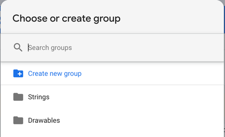

[](https://jitpack.io/#telereso/telereso)


Table of contents:

* auto-gen TOC:
{:toc}
 
## Installation

`Telereso` depends on Firebase to use [Remote Config](https://firebase.google.com/docs/remote-config/) for resource
management<br>
And [Cloud Messaging](https://firebase.google.com/docs/cloud-messaging) for realtime changes (_optional_)

All you need to get started is make sure your project has setup
firebase ([check docs](https://firebase.google.com/docs/guides)) <br>
then just add `Telereso` dependency to your project

### Gradle/maven dependency

<table>
<thead><tr><th>Approach</th><th>Instruction</th></tr></thead>
<tr>
<td></td>
<td>
    <pre>implementation "io.telereso:telereso:0.0.4"</pre>
    </td>
</tr>
<tr>
<td> (Kotlin DSL)</td>
<td>
    <pre>implementation("io.telereso:telereso:0.0.4")</pre>
    </td>
</tr>
</table>

## Firebase
This section will show how to set up firebase remote config to be used with `Telereso`

### Strings

#### Steps
* Open [Firebase console](https://console.firebase.google.com/) then select Remote Config Dashboard
* Add new param called `strings` <br><br>
  <br><br>
  
* Add a json containing key/value params representing your strings resource's key name (same key name found in the strings.xml), and it's value <br><br><br><br>
* Add to `Strings` group  (this is optional but good practice) <br><br> <br><br>
* Save and publish 

#### Localization
`Telereso` supports localization using local after the strings prefix `strings_<local>`<br>
To support other languages just add more params each containing a json with same keys (as in the strings version) but with a translated value <br>
ex: `strings_fr,strings_ar...etc`

_Android developers_ it will be the same local you add to your values dir `values-fr,values-ar...etc`

_Notice we are using `_` instead of `-` due to remote config limitations_

### Drawable

#### Steps

* Open [Firebase console](https://console.firebase.google.com/) then select Remote Config Dashboard
* Add new param called `drawable`
* Add a json containing key/value params representing your drawable resource's key name (same key name found in the drawable dir), and it's value will be a url of your remote image <br><br><br><br>
* Add to `Drawable` group  (this is optional but good practice) <br><br><br><br>
* Save and publish

#### Android Screens support
To support multiple screens sizes for android add the same sizes used with drawable dirs <br>
ex: `drawable_hdpi,drawable_xhdpi`

_Notice we are using `_` instead of `-` due to remote config limitations_


### Final Result


### Conditional Resources
Remote Config provide conditions to be applied to your params (strings,drawables),<br>
This will add another layer of dynamic delivery,
so if you would like new versions to have specific resources,<br> or segment of users that clicked a button,<br>
Or strings and icons to be shown on specific days (Holidays 🎊🥳🎉!)...etc <br><br>
You can see how `Telereso` will help avoid multiple app releases.
<br><br>


### A/B Testing
One of the great feature about Remote config is the out of the box [A/B testing](https://firebase.google.com/docs/ab-testing) <br>
Since all our resources are indexed as params we could easily create experiments. <br>
The following example show how we can test Drawer titles and see which one achieve higher conversion <br><br>

_This can be used for icons as well_

## Samples & Examples 
Nothing feels better than a snippet of code ready to be copied!
Check samples in this [repo](https://github.com/telereso/telereso/tree/master/Samples)

* [Android](https://github.com/telereso/telereso/tree/master/Samples/android)

## Usage

There are different scenarios to work with `Telereso` ,<br>
Wither you are starting a fresh new application, or an already in production application with large code base

### Android

#### Initialization

Initialization will not make api calls it just to set up resources,<br>
If your app has a splash screen it would be a perfect place to do this, or on your custom application class<br>
The `init` function has a call back you can listen to,<br>
Or you could use the suspended version `suspendedInit` if you're a coroutines' lover!.

Skipping the Initialization will not cause crashes, but the app will not be able to use the remote version of the
resources,<br>
So it is a way to disable remote functionality.

_Kotlin_

```kotlin
//application
class MyApplication : Application() {
    override fun onCreate() {
        super.onCreate()
        Telereso.init(this)
    }
}
```

or

```kotlin
class SplashActivity : Activity {
    private override fun onCreate(savedInstanceState: Bundle?) {
        super.onCreate(savedInstanceState);
        Telereso.init(this) {
            // start MainActivity and finish()
        }
    }
}
```

_Java_

```java
//application
public class MyApplication extends Application {
    @Override
    public void onCreate() {
        super.onCreate();
        Telereso.init(this);
    }
}
```

or

```java
public class SplashActivity extends Activity {
    @Override
    protected void onCreate(Bundle savedInstanceState) {
        super.onCreate(savedInstanceState);
        Telereso.init(this, () -> {
            // start MainActivity and finish()
            return null;
        });
    }
}
```

#### Add `RemoteViewInflater`

This inflater will make sure all the android application views that display strings or images have the remote
functionality,<br>
The inflater will detect if you're setting the text in the xml directly like `andriod:text=@stirngs/user_name`<br>
And use the remote version if it's found or default back to the original value<br>

The inflater handles the following views :

* TextView
* EditText
* ImageView
* Button
* ImageButton
* FloatingActionButton
* BottomNavigationView
* NavigationView

you can use the inflater with `App Theme` or `Activity Theme`

*App Theme*

If your activities Does not use their own custom theme , add `RemoteViewInflater` directly to the app theme as
the `viewInflaterClass`

```xml

<style name="AppTheme" parent="Theme.AppCompat.Light.NoActionBar">
    <item name="colorPrimary">@color/style_color_primary</item>
    <item name="colorPrimaryDark">@color/style_color_primary_dark</item>
    <item name="colorAccent">@color/style_color_accent</item>
    <item name="colorControlHighlight">@color/fab_color_pressed</item>
    <item name="viewInflaterClass">io.telereso.android.RemoteViewInflater</item>
</style>
```

*Activity Theme*

if your activity uses a custom theme add `RemoteViewInflater` to that theme

```xml

<style name="AppTheme.TransparentActivity">
    <item name="android:windowBackground">@android:color/transparent</item>
    <item name="android:windowIsTranslucent">true</item>
    <item name="viewInflaterClass">io.telereso.android.RemoteViewInflater</item>
</style>
```

#### Dynamic Resources

Sometimes we set the resrouces programmatically depending on a view state like so
`title = getString(R.strings.title_home)`,<br>
In this case we can use the Remote version of the function `getString()`
which is
`getRemoteString()`<br>
This will make sure to use the remote version of the resource if found or default it to the original value

*Strings*

_Kotlin_

```kotlin
titleTextView.text = getRemoteString(R.strings.title_home)
```

_Java_

```java
titleTextView.setText(Telereso.getRemoteString(R.strings.title_home));
```

*Drawables*

_kotlin_

```kotlin
imageView.setRemoteImageResource(R.id.icon)
```

_java_

```java
Telereso.setRemoteImageResource(imageView,R.id.icon);
```

#### Dynamic Resources || (out of the box)

If you have a large code base and have a lot of `getString()` and `setImageResource`, <br>
And replacing them with a remote version is not an option,<br>
You can override the activity's context with a `RemoteWrapperContext`<br>
That will take care of the changes for you without any code changes.

**Important note** if your app supports both portrait and land scape you need to handle the configuration changes
manually,<br>
Later versions of `Telereso` will address this issue


Add the following to all your activities or your `BaseActivity`

_Kotlin_

```kotlin
class MainActivity : Activity {
    override fun attachBaseContext(newBase: Context) {
        super.attachBaseContext(RemoteContextWrapper(newBase));
    }
}
```
_Java_
```java
public class MainActivity extends Activity {
    @Override
    protected void attachBaseContext(Context newBase) {
        super.attachBaseContext(new RemoteContextWrapper(newBase));
    }
}
```
#### Realtime Changes 

Who does love to see his changes happing in real time ?<br>
`Telereso` support this optional implantation with some extra steps.

## Telereso API

Here are tables to help you use the library.

### Kotlin

|Function|Description|
|--------|-----------|
|`init(Context,finishCallback)`|setup resources to be used,finishCallback will be called as soon resources are ready, also will fetchAndActivate Remote config but will not block the init (finishCallback will be called before the fetch finishes)|
|`suspendedInit(Context,finishCallback)`|used inside other suspended functions or coroutines, it will fetchAndActivate Remote config then setup resources)|
|`Context.getRemoteString(R.string.<string_id>)`|return remote string or original value|
|`View.getRemoteString(R.string.<string_id>)`|return remote string or original value|
|`View.getRemoteString(R.string.<string_id>)`|return remote string or original value|
|`ImageView.setRemoteImageResource(R.string.<res_id>)`|set remote image resource or the original value|

### Java

|Function|Description|
|--------|-----------|
|`Telereso.init(Context,finishCallback)`|setup resources to be used,finishCallback will be called as soon resources are ready, also will fetchAndActivate Remote config but will not block the init (finishCallback will be called before the fetch finishes)|
|`Telereso.getRemoteString(Context, R.string.<string_id>)`|return remote string or original value|
|`Teleresoset.getRemoteImageResource(ImageView,R.string.<res_id>)`|set remote image resource or the original value|

## Getting Help

To report bugs, please use the GitHub project.

* Project Page: [https://github.com/telereso/telereso](https://github.com/telereso/telereso)
* Reporting Bugs: [https://github.com/telereso/telereso/issues](https://github.com/telereso/telereso/issues)